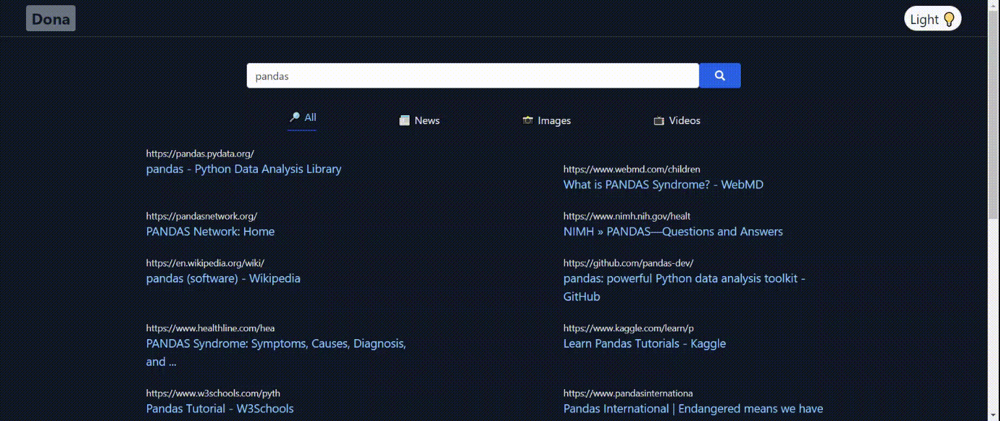

# Dona Search Engine

<a href = "https://angry-easley-d39929.netlify.app/videos">A search engine that's powered by Google's API</a>

<h3>Technologies used</h3>
<ul>
    <li>
        React
    </li>
    <li>
        React Context
    </li>
    <li>
        React Routing
    </li>
    <li>
        JavaScript
    </li>
    <li>
        APIs
    </li>
    <li>
        Tailwind
    </li>
    <li>
        CSS
    </li>
    <li>
        Netlify
    </li>
</ul>

<h3>Known bugs</h3>
<ul>
    <li>
        The search button will not work unless a new search is typed into the search bar. Defaults searches have mixed results
    </li>
</ul>

